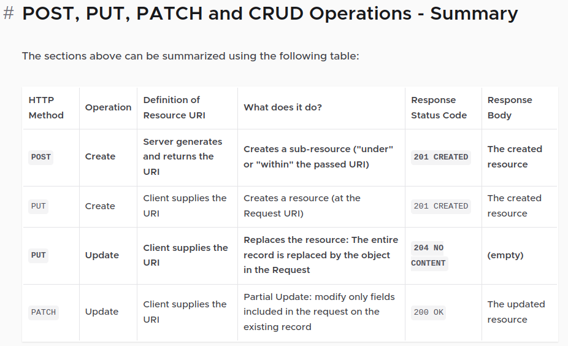

# simple-rest-api-with-spring-boot

## Simple CRUD RESTful API with Spring using TDD principles and Spring Secutiry

## Must reading:
- Assertj for testing assertions: https://assertj.github.io/doc/
- JsonPath for extracting information from response on tests: https://github.com/json-path/JsonPath
- Spring TestRestTemplate for IT tests: https://docs.spring.io/spring-boot/api/java/org/springframework/boot/test/web/client/TestRestTemplate.html
- RFC 9110 HTTP Semantics: https://www.rfc-editor.org/rfc/rfc9110#name-normative-references
- Cross-Site Request Forgery Prevention Cheat Sheet: https://cheatsheetseries.owasp.org/cheatsheets/Cross-Site_Request_Forgery_Prevention_Cheat_Sheet.html

---
---
